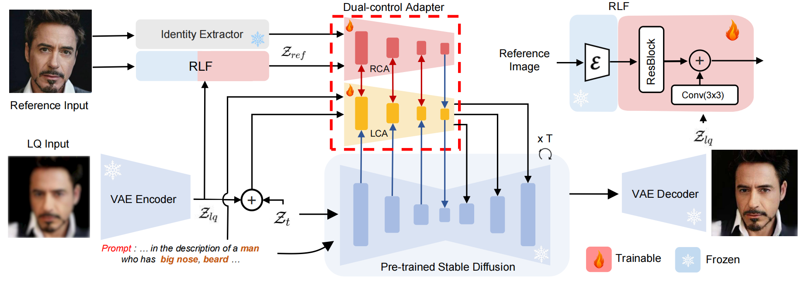
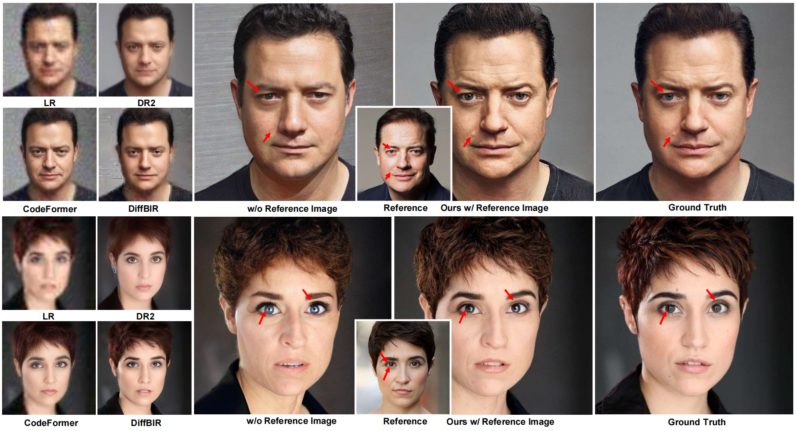
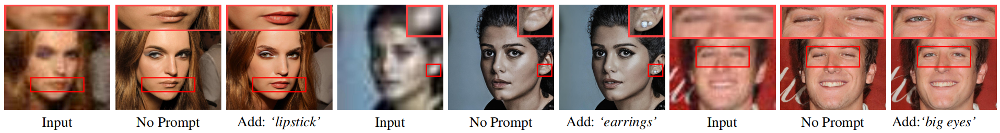
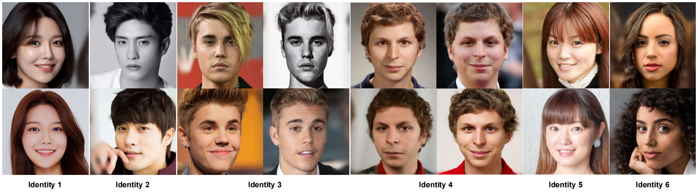

# MGBFR : **Overcoming False Illusions in Blind Face Restoration with Multi-Modal Guided Diffusion Model**

Keda Tao, [Jinjin Gu](https://www.jasongt.com/), [Yulun Zhang](http://yulunzhang.com/),  Xiucheng Wang and Nan Cheng, "Overcoming False Illusions in Blind Face Restoration with Multi-Modal Guided Diffusion Model"

    

[arXiv](https://arxiv.org/abs/2410.04161) [visual results] [pretrained models]

#### 🔥🔥🔥 News

- **2024-2-27:** This repo is released.

---

> **Abstract:** We introduce a novel Multi-modal Guided Blind Face Restoration (MGBFR) technique to enhance the quality of facial image recovery from low-quality inputs. Leveraging a blend of attribute text prompts, high-quality reference images, and identity information, MGBFR can mitigate the generation of false facial attributes and identities often associated with generative face restoration methods. By incorporating a dual-control adapter and a two-stage training strategy, our method effectively utilizes multi-modal prior information for targeted restoration tasks. We also present the Reface-HQ dataset, comprising over 23,000 high-resolution facial images across 5,000 identities, to address the need for extensive reference material. Our approach achieves superior visual quality in restoring facial details under severe degradation and allows for controlled restoration processes, enhancing the accuracy of identity preservation and attribute correction. Including negative quality samples and attribute prompts in the training further refines the model's ability to generate detailed and perceptually accurate images. 

## :eyes:Visual Results
### Face Restoration

    

    

### Reface-HQ Dataset

    

## ⚒️ TODO

* [ ] Release Paper
* [ ] Release code and pretrained models

## Acknowledgement

This project is based on [ControlNet](https://github.com/lllyasviel/ControlNet). Thanks for their awesome work.

## Contact

If you have any questions, please feel free to contact with me at KD.TAO.CT@outlook.com
